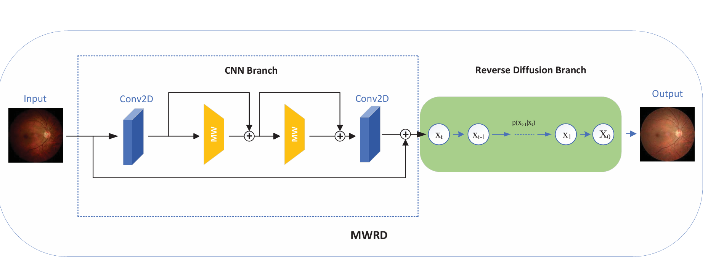
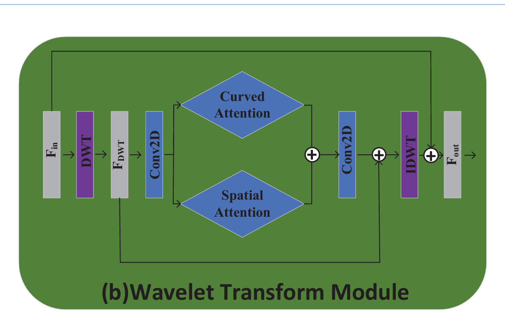
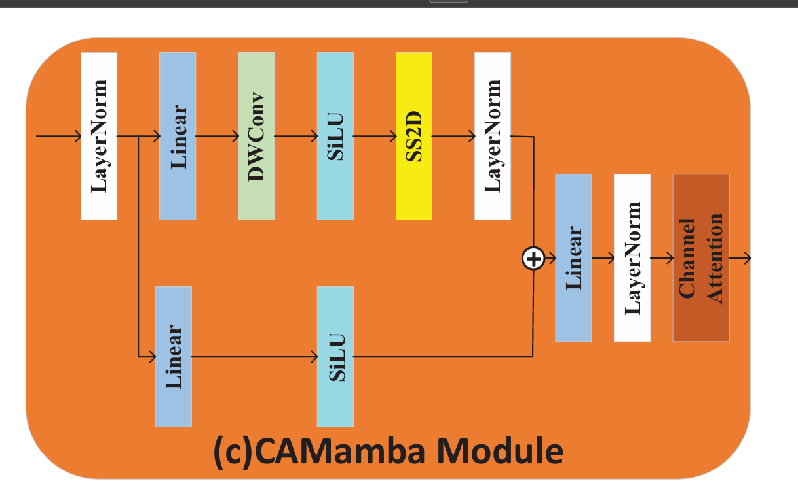
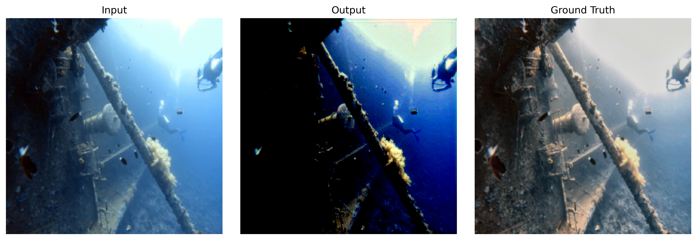
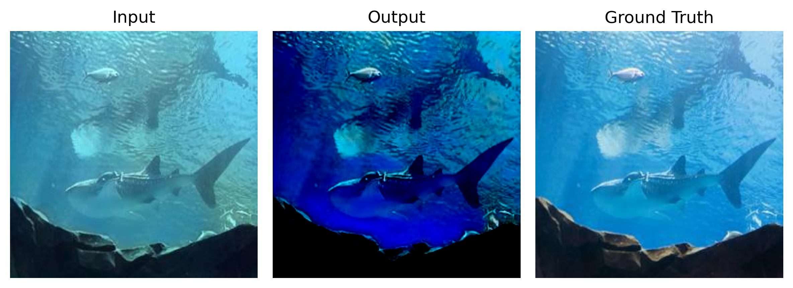
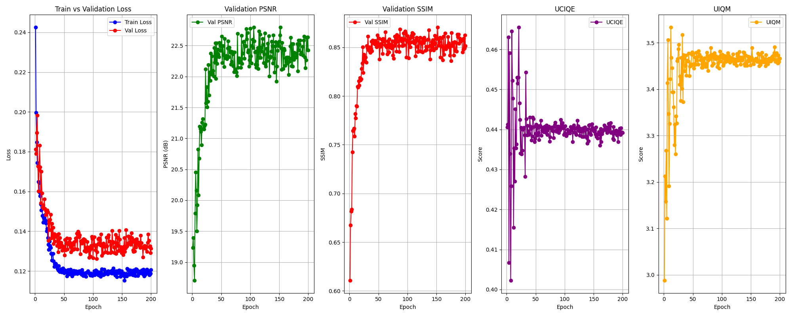

# Mamba Wavelet Reverse Diffusion (MWRD)
### Underwater Image Enhancement using Wavelet Transform, CAMamba, and Diffusion Refinement


<p align="center">
  
  
  
  
</p>

---

# Project Overview

This project focuses on **Underwater Image Enhancement and Restoration** using a hybrid deep learning framework that combines:

- Wavelet-based Multi-scale Feature Extraction
- CAMamba State-Space Modeling
- Attention Mechanisms
- Reverse Diffusion Refinement (DDPM)

The model is designed to restore degraded underwater images affected by:

- Color distortion
- Haze/scattering
- Low contrast
- Blur
- Loss of structural details

The proposed architecture improves visual quality while maintaining computational efficiency.

---

# Motivation

Traditional CNN-based enhancement models struggle to capture long-range dependencies, while transformer-based methods are computationally expensive.

This project explores a lightweight yet powerful hybrid architecture integrating:

- **Wavelet Transform** for frequency decomposition
- **Mamba (State Space Models)** for global context learning
- **Diffusion Models (DDPM)** for perceptual refinement

---

# Architecture

## Overall Pipeline

<p align="center">
  
</p>

The framework contains two major components:

1. **CNN Feature Extraction Branch**
2. **Reverse Diffusion Refinement Branch**

---

# 🔬 Core Components

## Wavelet Transform Module

- Uses **Discrete Wavelet Transform (DWT)**
- Extracts:
  - Low-frequency structure
  - High-frequency textures
- Improves edge preservation and detail reconstruction

<p align="center">
  
</p>

---

## CAMamba Block

The CAMamba block integrates:

- SS2D Selective Scan
- Depthwise Convolution
- Channel Attention
- Residual Fusion

Advantages:
- Efficient global modeling
- Linear computational complexity
- Better long-range feature learning

<p align="center">
  
</p>

---

## Diffusion Refiner (DDPM)

A reverse diffusion process is used after CNN prediction to progressively refine outputs.

Benefits:
- Better texture recovery
- Improved perceptual realism
- Reduced artifacts


---

# Dataset

This project uses two paired underwater datasets:

| Dataset | Description |
|---|---|
| UIEB | Real underwater enhancement benchmark |
| EUVP | Paired underwater image enhancement dataset |

## Dataset Split

### UIEB
- 90% Training
- 10% Validation

### EUVP
- 80% Training
- 20% Validation

---

# Preprocessing

- Resize images to `256 × 256`
- RGB conversion
- Tensor normalization `[0,1]`

### Data Augmentation
- Brightness adjustment
- Contrast adjustment
- Saturation adjustment
- Hue adjustment

---

# Evaluation Metrics

The following metrics were used:

| Metric | Purpose |
|---|---|
| PSNR | Reconstruction fidelity |
| SSIM | Structural similarity |
| UIQM | Underwater perceptual quality |
| UCIQE | Underwater color quality |

---

# Training Configuration

| Parameter | Value |
|---|---|
| Optimizer | AdamW |
| Learning Rate | 1e-4 |
| Batch Size | 4 |
| Epochs | 200 |
| Scheduler | Cosine Annealing |
| Framework | PyTorch |
| Python Version | 3.10 |

---

# Results

## UIEB Dataset Performance

| Metric | Baseline | Proposed |
|---|---|---|
| PSNR ↑ | 22.56 | **22.8474** |
| SSIM ↑ | 0.8572 | **0.8949** |
| UIQM ↑ | 3.5148 | **3.6973** |
| UCIQE ↑ | **0.4661** | 0.4569 |

---

# Qualitative Results

## UIEB Samples

<p align="center">
  
</p>

---

## EUVP Samples

<p align="center">
  
</p>

---

# Training Curves

<p align="center">
  
</p>

### Observations
- Faster convergence
- Lower validation loss
- Better SSIM stability
- Improved perceptual enhancement

---

# Proposed Improvements

Compared to the baseline model, the proposed architecture introduces:

Multi-attention wavelet refinement  
Parallel SS2D integration  
Hybrid perceptual loss  
AMP mixed precision training  
Cosine annealing scheduler  

---

# Loss Function

The proposed hybrid loss:

```math
L = 0.6L_{L1} + 0.6L_{Charb} + 0.5L_{SSIM} + 0.3L_{Perceptual}
```

Where:
- **L1 Loss** → Pixel accuracy
- **Charbonnier Loss** → Smooth optimization
- **SSIM Loss** → Structural preservation
- **Perceptual Loss** → Semantic consistency

---

# Project Structure

```bash
MWRD/
│
├── datasets/
│   ├── UIEB/
│   └── EUVP/
│
├── models/
│   ├── wavelet.py
│   ├── camamba.py
│   ├── diffusion.py
│   └── model.py
│
├── utils/
│   ├── metrics.py
│   ├── losses.py
│   └── dataloader.py
│
├── outputs/
│   ├── checkpoints/
│   ├── results/
│   └── logs/
│
├── train.py
├── test.py
├── requirements.txt
└── README.md
```

---

# Installation

## Clone Repository

```bash
git clone https://github.com/Vandana-Jha30/mwrd_project.git
cd mwrd_project
```

---

## Install Dependencies

```bash
pip install -r requirements.txt
```

---

# Training

```bash
python train.py
```

---

# Testing

```bash
python test.py
```

---

# Hardware Used

- NVIDIA RTX GPU
- CUDA Support
- 16–32 GB RAM
- SSD Storage

---

# Key Learnings

- Wavelet decomposition improves texture retention.
- SS2D selective scanning enhances global context learning.
- Diffusion refinement significantly improves perceptual quality.
- Hybrid losses stabilize convergence and improve realism.

---

# Limitations

- Heavy diffusion refinement increases inference time.
- Extreme turbidity remains challenging.
- Model evaluated mainly on paired datasets.

---

# Future Scope

- Real-time underwater enhancement
- Model compression & deployment
- Adaptive loss weighting
- Multi-stage diffusion refinement
- Underwater object detection integration

---

# References

1. Ho et al. — *Denoising Diffusion Probabilistic Models* (NeurIPS 2020)
2. Gu & Dao — *Mamba: Linear-Time Sequence Modeling with Selective State Spaces*
3. LLCAPS — *Curved Wavelet Attention and Reverse Diffusion*
4. ECCV 2020 — *Learning Enriched Features for Real Image Restoration*

---

# Author

## Vandana Jha
M.Tech Computer Science  
Indian Institute of Technology Dharwad

---

# Project Report

This repository is based on the project report:

**“Mamba Wavelet Reverse Diffusion for Underwater Image Enhancement”** 

---

# Acknowledgement

Special thanks to:

- IIT Dharwad
- Research papers and open-source contributors
- PyTorch community

---

# If you found this project useful, consider giving it a star!
